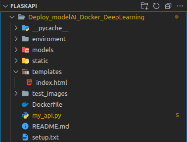

# Build-model-Deep-learning-Web-App-with-Flask-and-build-docker-image
How to Build a Machine Learning Web App with Flask and Build Docker Image

# Introduction
Machine Learning (ML) is a great way to do tasks that cannot be explicitly coded, for example, image classification. But when the model is already built, it will be useless when we don’t deploy it into an application.

Deployment is an essential step in the machine learning workflow. It is a step where we want to apply our ML model into an application. Afterwards, we can use the model in real life.

But how can we create the model as an application? We can build an Application Programming Interface (API). 

In this article, we will go through the process of building and deploying a machine learning web app using Flask and PythonAnywhere.

# REST API
REST API stands for Representational State Transfer Application Programming Interface.

The mechanism of REST API looks like this. Let’s say you want to search cat photos on Google. The first step is to send a request to Google by giving them a query like ‘cat photos’. Then, the server will send you a response to your computer, which is the compilation of cat photos.

That’s all about the REST API! It’s the way to communicate between you as the client by requesting something to the server, and then the server will send you the response. Here is an illustration of how the REST API works.


## What is Flask API?
Flask is a python framework that is used to create microservice web application. It aims to keep projects simple but extensible and it won't decide for you, i.e. It allows you to create functionalities and has fewer packages or tell you what type of database to be used in a project.


# Implementation
## How to training and save the machine learning model

In the section, I will build a simple cat and dog Image Classification problem.

I train the model on colab google, you can check it out. Link colab: [Google Colab](https://colab.research.google.com/drive/12estOLHbLC9qbg9tXiF4Hu3jYEdJ5gBx?usp=sharing)


## How to Build a Backend using Flask
Before getting started, let's understand the directory structure we are going to follow. Directory structure:



In python, before doing anything. We will set up the enviroment for our project. It is advisable to create a virtual enviroment and use it to install frameworks so your project folder looks neat. as follows:

```
$ python3 -m venv name_of_my_env

$ source name_of_ny_env/bin/activate

$ python3 -m pip install --upgrade pip
```

Done , now we will install setup.txt file:

```
$ cd name_of_my_env

$ pip3 install -r setup.txt
```

The setup.txt file is configured as follows:
```
opencv-python
tensorflow
flask
flask-cors
pillow
```

Now, onto your code!

Create a python file and name, my_api.py

This file will be like an entry file which will lead to other codebase in the projects. 

Write this in my_api.py file:

``` python
from flask import Flask, request, render_template
import numpy as np
import os
import cv2
from keras.models import load_model
from tensorflow.keras.preprocessing.image import load_img, img_to_array

#Config
model_file = "models/cat_dog_classifier.hdf5"
app = Flask(__name__)
app.config['UPLOAD_FOLDER'] = "static"
dic = {0 : 'Cat', 1 : 'Dog'}

# Load model

model = load_model(model_file)
model.make_predict_function()

def predict_label(img_path):
    i = load_img(img_path, targer_size=(150,150))
    i = img_to_array(i)/255.0
    i = i.reshape(1, 150, 150, 3)
    prediction_prob = model.predict(i)[0][0]
	if prediction_prob < 0.5: # 0-0.5: cat, else dog
		output = "cat"
	else:
		output = "dog"

	return output

@app.route("/", methods=['GET', 'POST'])
def get_output():
    if request.method == 'POST':
        img = requestz.files['my_image']
        img_path = "static/" + img.filename
        img.save(img_path)
        
        p = predict_label(img_path)

    return render_template("index.html", prediction=p, img_path=img_path)

if __name__ == '__main__':
    app.run(host='0.0.0.0', port=8080)

```

## How to build a web page using HTML

### Creating template folder

Create a template folder and an HTML file will name it index.html as stated in the previous code and create another file name layout.html

We will use HTML form to create a form that a user can fill out to get their predictions.

Write the following code in your layout file:

``` html
<!DOCTYPE html>
<html lang='en'>
<head>
    <title> Image Classification </title>
    <meta charset='utf-8'>
    <meta name='viewport' content='width=device-width, initial-scale=1'>
    <link rel="stylesheet" href="https://maxcdn.bootstrapcdn.com/bootstrap/3.4.1/css/bootstrap.min.css">
    <script src="https://ajax.googleapis.com/ajax/libs/jquery/3.5.1/jquery.min.js"></script>
    <script src="https://maxcdn.bootstrapcdn.com/bootstrap/3.4.1/js/bootstrap.min.js"></script>
</head>
<body>

<div class="container">
    <h1 class="jumbotrom bg-primary"> Image Classfication </h1>
    <br><br>

    <div class="container">
    <h1 class="jumbotron bg-primary">Image Classfication</h1>
    <br><br>
    <form class="form-horizontal" action="/submit" method="post" enctype="multipart/form-data">

        <div class="form-group">
            <label class="control-label col-sm-2" for="pwd">Upload Your Image :</label>
            <div class="col-sm-10">          
                <input type="file" class="form-control" placeholder="Hours Studied"  name="my_image" id="pwd">
            </div>
        </div>
        <div class="form-group">        
            <div class="col-sm-offset-2 col-sm-10">
                <button type="submit" class="btn btn-success">Submit</button>
            </div>
        </div>
    </form>

    
  
	<h2> Your Prediction   : <i> {{prediction}} </i></h2>
	

</div>
</body>
</html>
```

### Adding CSS to Our Website

In the same way as we created a folder called templates to store all our all our HTML templates, we need a folder called static.

In static, we will store our CSS, JavaScript, images, and other necessary files. That is why it is important that you should create CSS folder to store your stylesheets. After you do this, your project folder should look like this:


Then run it by doing on your terminal:

```
$ python my_api.py
```

Or you can run terminal as:

```
$ export FLASK_APP=my_api
$ flask run
```

Now let's acess the API by address http://127.0.0.1:8080/, where 127.0.0.1 is your local address, and 8080 is the port number to access the API.

Great! Our API starts perfectly.


## How to Deploy it to build docker?

### Why do you need to build docker?

- The installation of deep learning framework is error prone, docker allows reuse of pre-built enviroment without complicated installation

- Docker makes it easy to deploy training enviroment for deep learning model on variety of servers.

- Deep learning applications are also easy to deploy and make available to customer via docker.

- Each project needs to install many things, many libraries to run, while the documentation is not clear, and somtimes there is documentation, but we cant install and run it sucessfully due to the difference between the running enviroments. 

## What is Docker?

Docker is a tool that allows to run project in a specific, well-defined enviroment, independent of the original enviroment. Applications that run in Docker are called Containers. 

Please Make sure you have Docker installed !!

Configure Dockerfile

You create a file named Dockerfile, inside with the following content:

```shell 
FROM ubuntu:latest
WORKDIR /app
RUN apt-get update -y
RUN apt-get install -y python3-pip pyhton3-dev build-essential hdf5-tools libgl1 libgtk2.0-dev
COPY . /app
RUN pip3 install -r setup.txt
EXPOSE 8080
CMD ["python3", "my_api.py"]

```

## Build Docker Image

The next step is to build the Image only. Run the following command to build the Image:

```
$ docker build -t myapi_docker . 
```

After the Image build process is successful, you can checkk with the command:
```
$ docker images
```

Now, run:
```
$ docker run -p 8080:8888 myapi_docker
```

You notice above when mapping port, on the right is the port of the project running in the container, on the left is the port in the original enviroment (outside, we can choose arbitrarily, and here, port 8888 is the port that the user uses. Will use for in-browser access)

Now we can access this web application from another machine via the machine's IP address and port 8888!


## References
[How to build a web application using Flask and deploy it to the CLoud](https://www.freecodecamp.org/news/how-to-build-a-web-application-using-flask-and-deploy-it-to-the-cloud-3551c985e492/)


[How to Turn Your Jupyter Notebook into a User-Friendly Web APP](https://www.freecodecamp.org/news/machine-learning-web-app-with-flask/ )


[How to Develop an End-to-End Machine Learning Project and Deploy it to Heroku with Flask](https://www.freecodecamp.org/news/end-to-end-machine-learning-project-turorial/ )


[Building a Machine Learning Web Application Using Flask](https://towardsdatascience.com/building-a-machine-learning-web-application-using-flask-29fa9ea11dac)


[Flask Documentation](https://flask.palletsprojects.com/en/1.1.x/quickstart/#apis-with-json)
